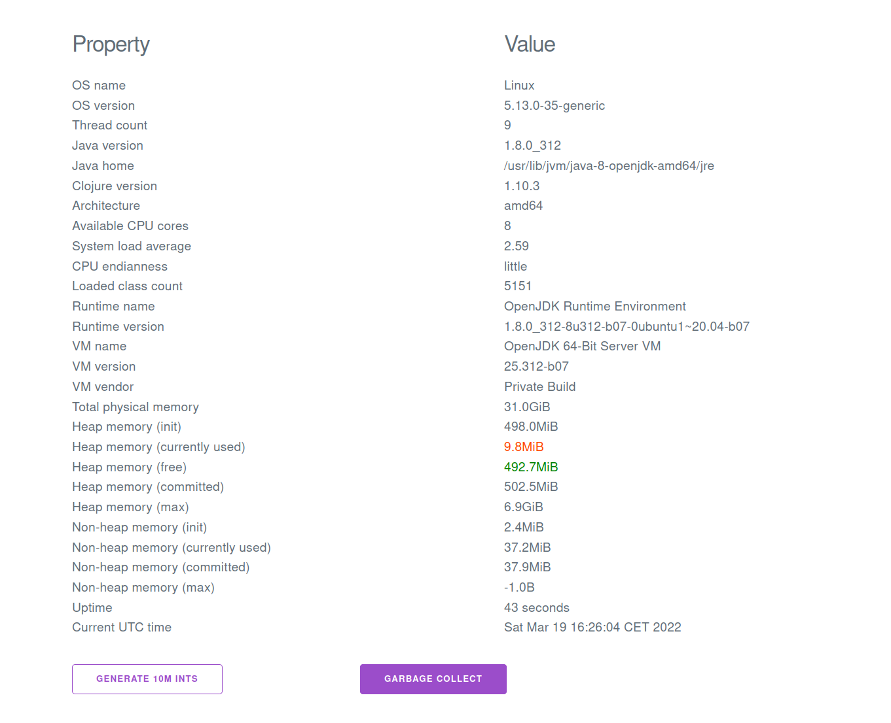

# System info

Small deployable JAR that displays basic system info. HTML + JSON `/api` interface.




## Usage

To build:

```
$ clojure -X:uberjar
```

To run:

```
$ java -jar sysinfo.jar
```

## Deployment

Procfile available to deploy on Heroku, Dokku, etc
